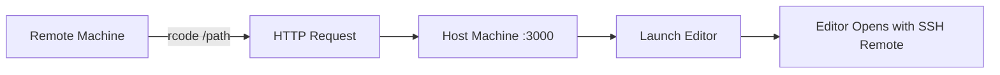

# RCode - Remote Code Launcher

[](https://github.com/foxytanuki/rcode/actions/workflows/ci.yml)
[](https://goreportcard.com/report/github.com/foxytanuki/rcode)
[](https://opensource.org/licenses/MIT)

Launch your local code editor from SSH-connected remote machines without an SSH server on the host.

## 🚀 Overview

RCode enables seamless code editing when working on remote servers. Open files from your SSH session directly in your local editor (Cursor, VSCode, Neovim, etc.) with a simple command.

### How It Works



## ✨ Features

- 🚀 **Instant Editor Launch** - Open files in your local editor with one command
- 🔌 **Multiple Editor Support** - Cursor, VSCode, Neovim, and more
- 🌐 **Network Fallback** - Automatic failover from LAN to Tailscale
- 🔒 **Secure by Design** - IP whitelist, rate limiting, no SSH server needed
- 🎯 **Zero Config** - Works out of the box with sensible defaults
- 🐧 **Cross-Platform** - macOS and Linux support

## 📦 Installation

### Using Pre-built Binaries

Download the latest release for your platform:

```bash
# macOS (Apple Silicon)
curl -L https://github.com/foxytanuki/rcode/releases/latest/download/rcode-darwin-arm64.tar.gz | tar xz
sudo mv rcode-* /usr/local/bin/

# macOS (Intel)
curl -L https://github.com/foxytanuki/rcode/releases/latest/download/rcode-darwin-amd64.tar.gz | tar xz
sudo mv rcode-* /usr/local/bin/

# Linux (x86_64)
curl -L https://github.com/foxytanuki/rcode/releases/latest/download/rcode-linux-amd64.tar.gz | tar xz
sudo mv rcode-* /usr/local/bin/
```

### Building from Source

Requirements:
- [mise](https://mise.jdx.dev/) - for Go toolchain management
- Make

```bash
# Install mise (if not already installed)
curl https://mise.run | sh
echo 'eval "$(~/.local/bin/mise activate bash)"' >> ~/.bashrc  # or ~/.zshrc
source ~/.bashrc

# Clone and build
git clone https://github.com/foxytanuki/rcode.git
cd rcode
mise install  # Install all tools specified in .mise.toml
make build
make install  # Installs to /usr/local/bin
```

Alternative without mise (requires Go 1.21+ pre-installed):
```bash
git clone https://github.com/foxytanuki/rcode.git
cd rcode
go build -o bin/rcode-server ./cmd/server
go build -o bin/rcode ./cmd/rcode
sudo cp bin/* /usr/local/bin/
```

## 🚦 Quick Start

### Step 1: Start the Server (Host Machine)

On your Mac or Linux host machine where your editors are installed:

#### Option A: Install as System Service (Recommended)

Install rcode-server as a system service that starts automatically on login:

```bash
# Install the service (one-time setup)
rcode-server -install-service

# Check service status
rcode-server -status-service

# Manually start/stop if needed
rcode-server -start-service
rcode-server -stop-service
```

**macOS**: The service will be installed as a launchd user agent and start automatically on login.  
**Linux**: The service will be installed as a systemd user service and start automatically on login.

#### Option B: Run Manually

If you prefer to run the server manually:

```bash
rcode-server
```

The server will start on port 3000 and display:
```
INFO Starting rcode-server version=0.1.1 host=0.0.0.0 port=3000
INFO Server listening address=0.0.0.0:3000
```

**Note**: With the manual approach, you'll need to keep the terminal open. The service approach (Option A) is recommended for convenience.

### Step 2: Configure the Client (Remote Machine)

On your remote machine, create `~/.config/rcode/config.yaml`:

```yaml
network:
  primary_host: "192.168.1.100"  # Your host machine's IP
  fallback_host: ""               # Optional: Tailscale IP

default_editor: cursor  # or vscode, nvim

# Optional: Override SSH host for editor connection
# ssh_host: "192.168.1.50"  # Use specific IP instead of auto-detection
# ssh_host: "remote-dev"    # Or use hostname from ~/.ssh/config
```

Find your host IP:
```bash
# On macOS
ifconfig | grep "inet " | grep -v 127.0.0.1

# On Linux  
ip addr show | grep "inet " | grep -v 127.0.0.1
```

**Note about SSH host detection:** By default, rcode uses the IP address from SSH_CONNECTION (where you SSHed from). If you're using Tailscale or other VPN for SSH, you may need to set `ssh_host` to your LAN IP or a hostname configured in your host's `~/.ssh/config`.

### Step 3: Open Files from Remote

SSH into your remote machine and use rcode:

```bash
# Open current directory
rcode .

# Open specific file or directory
rcode /home/user/project

# Use a specific editor
rcode --editor vscode /path/to/file

# List available editors
rcode --list-editors
```

## ⚙️ Configuration

### Service Management

Manage rcode-server as a system service:

```bash
# Install service (starts automatically on login)
rcode-server -install-service

# Uninstall service
rcode-server -uninstall-service

# Start/stop service manually
rcode-server -start-service
rcode-server -stop-service

# Check service status
rcode-server -status-service
```

**Service Logs**:
- macOS: `~/.local/share/rcode/logs/service.log`
- Linux: `~/.local/share/rcode/logs/service.log`

### Server Configuration

Location: `~/.config/rcode/server-config.yaml`

See [examples/server-config.yaml](examples/server-config.yaml) for a complete example.

Key settings:
- **Editors**: Configure available editors and their commands
- **IP Whitelist**: Restrict access to specific IPs/networks
- **Logging**: Control log levels and output

### Client Configuration  

Location: `~/.config/rcode/config.yaml`

See [examples/config.yaml](examples/config.yaml) for a complete example.

Key settings:
- **Network**: Configure primary and fallback hosts
- **Default Editor**: Set your preferred editor
- **SSH Host**: Override the SSH host for editor connections
- **Retry Logic**: Configure timeout and retry behavior

### Environment Variables

Override configuration with environment variables:

```bash
# Server
RCODE_HOST=0.0.0.0 RCODE_PORT=3001 rcode-server

# Client
RCODE_HOST=192.168.1.200 RCODE_EDITOR=vscode rcode /path
```

## 🎯 Common Use Cases

### Remote Development

Perfect for development on cloud VMs, containers, or remote servers:

```bash
# On AWS EC2, GCP, Azure VMs
rcode ~/project

# In Docker containers
docker exec -it container_name rcode /app

# On Kubernetes pods
kubectl exec -it pod_name -- rcode /app
```

### Tailscale Network

Use Tailscale for secure access from anywhere:

```yaml
# config.yaml
network:
  primary_host: "192.168.1.100"     # LAN IP
  fallback_host: "100.101.102.103"  # Tailscale IP

# If SSH-ing via Tailscale, specify LAN IP for editor
ssh_host: "192.168.1.50"  # Your remote machine's LAN IP
```

### Multiple Editors

Configure different editors for different file types:

```bash
rcode --editor cursor main.go     # Go development
rcode --editor vscode index.html  # Web development  
rcode --editor nvim config.yaml   # Quick edits
```

## 📡 API Documentation

RCode server exposes a REST API. See [docs/API.md](docs/API.md) for complete documentation.

Quick example:
```bash
# Open editor via API
curl -X POST http://localhost:3000/open-editor \
  -H "Content-Type: application/json" \
  -d '{"path": "/home/project", "user": "alice", "host": "server"}'

# Check health
curl http://localhost:3000/health
```

## 🔧 Troubleshooting

### Server not reachable

1. Check firewall settings:
```bash
# macOS
sudo pfctl -d  # Temporarily disable firewall

# Linux
sudo ufw allow 3000  # Allow port 3000
```

2. Verify server is running:
```bash
curl http://localhost:3000/health
```

3. Test from remote:
```bash
telnet YOUR_HOST_IP 3000
```

### Editor not opening

1. Check editor availability:
```bash
rcode --list-editors
```

2. Verify SSH connection info:
```bash
echo $SSH_CONNECTION
```

3. Try manual command (shown on error):
```bash
# Example manual fallback command
cursor --remote ssh-remote+user@host /path
```

### Debug mode

Enable verbose logging:
```bash
# Server
RCODE_LOG_LEVEL=debug rcode-server

# Client  
rcode --verbose /path
```

## 🤝 Contributing

Contributions are welcome! See [DEVELOPMENT.md](DEVELOPMENT.md) for development setup.

### Development Quick Start

```bash
# Install development tools (reads from .mise.toml)
mise install

# Or install specific tools manually
# mise use go@latest
# mise use golangci-lint@latest
# mise use lefthook@latest

# Install git hooks
make install-hooks

# Run all checks (fmt, vet, lint, test, build)
make check

# Run specific checks
make fmt        # Format code
make vet        # Run go vet
make lint       # Run golangci-lint
make test       # Run tests

# Build all platforms
make build-all
```

### Code Quality

This project uses:
- **Lefthook** for git hooks (pre-commit, pre-push)
- **golangci-lint** with multiple linters enabled
- **gofmt -s** for code formatting
- Automatic checks on commit and push

## 📄 License

MIT License - see [LICENSE](LICENSE) file.

## 🙏 Acknowledgments

- Inspired by the need for better remote development workflows
- Built with Go's excellent standard library
- Thanks to all contributors and users

## 📚 Resources

- [API Documentation](docs/API.md)
- [Development Guide](DEVELOPMENT.md)
- [Example Configurations](examples/)
- [Project Roadmap](docs/_local/TASK.md)

---

Made with ❤️ by [@foxytanuki](https://github.com/foxytanuki) and Claude Code
